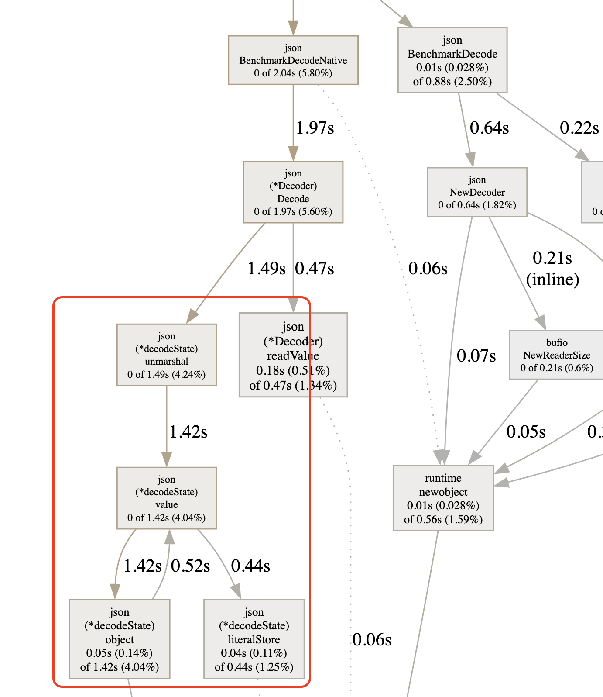

# My very own JSON parser

This package attempts to clean-room something close to the Go Standard Library's `encoding/json`
package. It is inspired by [this coding
challenge](https://codingchallenges.substack.com/p/coding-challenge-2).
Currently, it supports a minimal subset of functionality.

* Decodes simple objects (i.e., no nested objects) with string values.
* Decodes into interface types (i.e., no structs with tags).

## Current benchmarks vs Stdlib

With the most recent improvement that streams tokens to the parser (rather than allocating a slice
with all the tokens before starting parsing) this now actually performs _better_ than the Stdlib
version.

```
✗ go test -bench=.
goos: darwin
goarch: arm64
pkg: github.com/yardbirdsax/json
BenchmarkDecode-8                6030499               186.7 ns/op
BenchmarkDecodeNative-8          1388433               862.9 ns/op
```
> Note: The benchmarks for both actually improved because I didn't read from a file on each
> benchmark iteration; instead I buffered the file contents and read them.

However, it's not even close to being comparable feature-wise, so this isn't a fair competition. And
if we examine the `pprof` profile data, it's easy to see that the standard library's unmarshal logic
is likely why this is doing so much better.



Still, seeing how the performance improved so much with a slight change is interesting.
